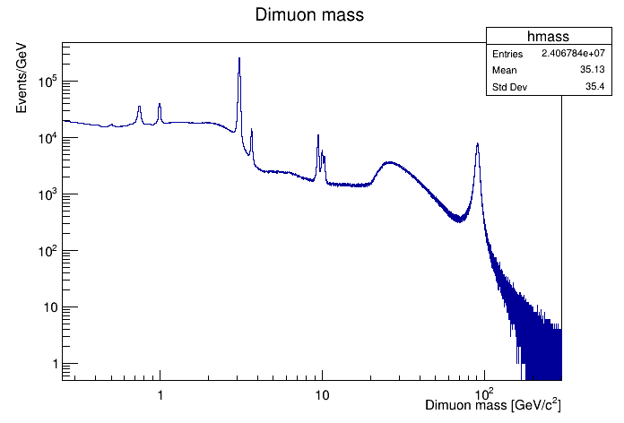

Use of Julia in a C++ HEP framework
===================================


Introduction
------------

We would like to investigate the possible use of the [Julia](https://wwww.julialang.org) programming language in a HEP C++-based framework.

HEP data are typically processed in a pipeline of codes executed in a loop over the physics events. 

The CMS experiment software framework, [CMSSW]() is based plugin modules. The physics event is represented by a C++ Event object that is passed from one module to the next one in the pipeline. A module can read data from the event, produce new data and add them to the event. The pipeline starts with a source module, that produces the initial events to process or read it from a file. The pipeline is run in a loop to process each initial event.

We propose to investigate the possibility of support the Julia programming language to write modules that could be executed together with modules written in C++.

Proof-of-concept
----------------

The test the idea we have written a C++ program that runs a pipeline of two code modules, one in Julia, one in C++. The program runs on the [CMS 2012 dimuon parked data set](http://doi.org/10.7483/OPENDATA.CMS.M5AD.Y3V3). It has a very simple format for an LHC experiment data set, which makes it convenient for such a test. The Julia module read data from each event and add data to it. It also acts as a filter selecting or rejecting the event.  The C++ module produces a histogram plot from the data produced by the Julia module.

Below is the plot produced by the C++ module using [ROOT](https://root.cern.ch) from the quantity computed by the Julia module.



The code requires the ROOT library and Julia. It can be compiled using the command `make`. The shell environment must be set up for ROOT (e.g. by sourcing the `bin/thisroot.sh` file of the ROOT distribution) for both compiling the code and running it.

The code can be executed with the command line,

```
./EventLoop root://eospublic.cern.ch//eos/opendata/cms/derived-data/AOD2NanoAODOutreachTool/Run2012BC_DoubleMuParked_Muons.root AnalysisModule1 AnalysisModule2
```
It will produce a `dimu.png` image file with the plot.

The pipeline
------------

The **steering event loop** is implemented in the `EventLoop.cc` source file. This represents the HEP framework.

The type of the `event` object is defined in the `Event.h` file. This object is accessible from both C++ and Julia (see the C++/Julia interface section below).

The **C++ module** is implemented in the `AnalysisModule1.cc` and compiled as a shared library.

The **Julia module** is implemented in the `AnalysisModule2.jl` in a Julia module.

The C++/Julia interface
-----------------------

The CxxWrap.jl library is used to provide the Julia code access to the C++ Event object. The wrapper is defined in the `EventLoopGlue.cc` and `EventLoopGlue.jl` files. Julia functions are called from C++ using the C binding built-in the Julia language and the Julia `@cfunction` macro.
